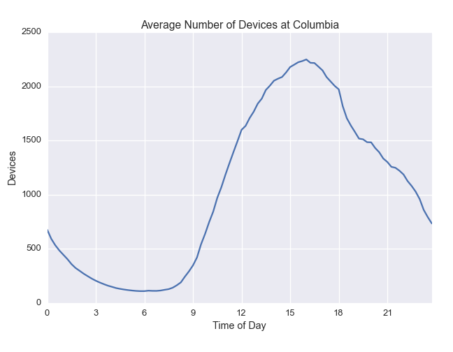
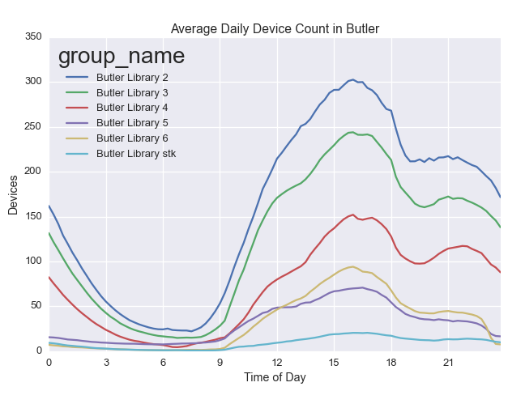
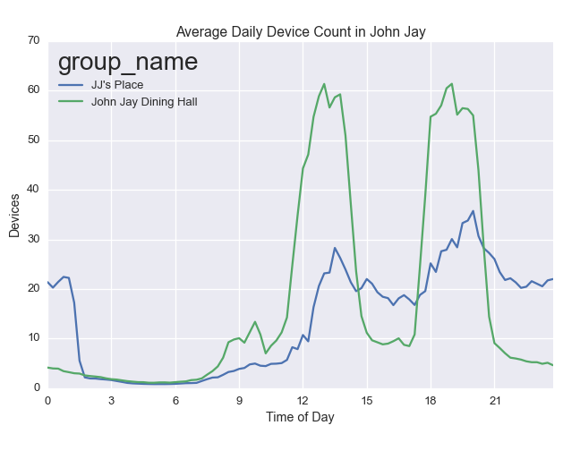
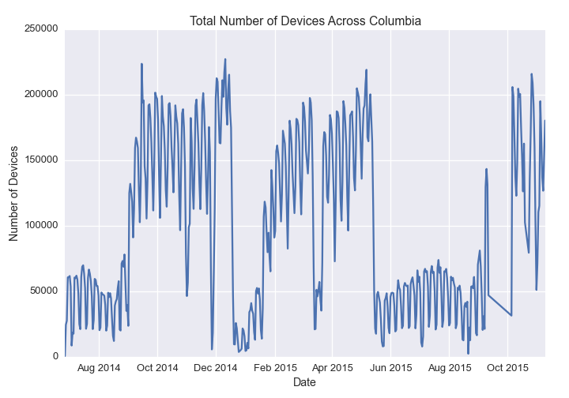
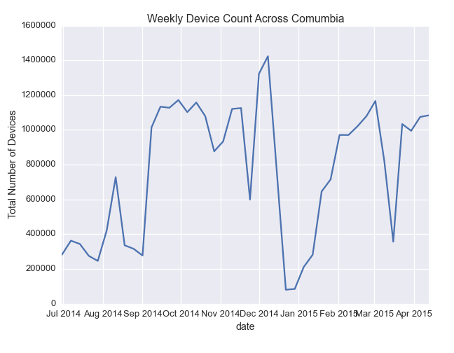
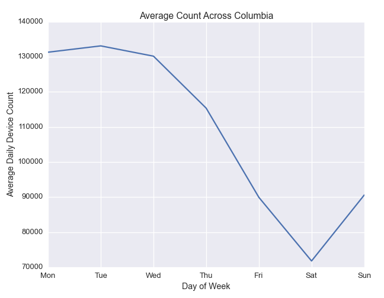
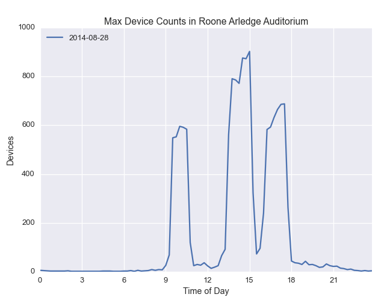
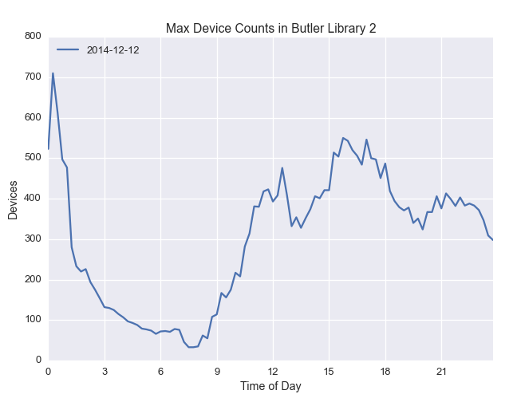

#What do we know about Density's data?

---

##[CUIT](https://cuit.columbia.edu/) has supplied us with our data set.

###We receive device counts from specific routers aggregated into 15 minute intervals

Devices connect to wifi routers across Columbia's campus.  CUIT aggregates device collection data by building and by floor and supplies with a live count of the number of devices connected at each location every 15 minutes.

---

#What spaces do we have?

###We have various libraries, John Jay, and Lerner.

---

#Just how full is a study space?

There's an obvious difference beteween a space that is unusually crowded like during orgo night, and a typical busy day.

Density assumes that capacity is relative to fullness on an average day, not on outlier days.  How do we do that? By considering what the average day like at each space.

###On an average day at Columbia, device count grows until it stablizes for the day

#Capacity is the level at which population growth stabilizes

###For the capacity of whole campus of Columbia, it would be 2248

---

#Different spaces have different properties

##For example, Butler library behaves very differently from John Jay:

###This is Butler:

People tend to come in after lunch, take a break for dinner, and work late into the night.

###This is John Jay:

The dining halls are most crowded around mealtimes.

---

#How does campus population vary over time?

###We can find differences in population based on changes in semesters, exams, and holidays

There's a clear weekly cycle in the number of devices connected across campus.  Let's remove the weekly cycle by grouping the data into weeks. Smoothing out the data by grouping by week allows us to see differences in semesters and holidays more clearly e.g. the big drop around Thanksgiving and the following spike for Finals.

Aggregating the data by week allows us to see that there's a jump in the number of devices when the semester starts.  We also see dips for fall break, spring break, and Thanksgiving.  Thanksgiving is followed by a spike for finals.  Winter break is also visible following the dramatic drop in device count.

---

##How does day of the week affect study habits?

###People don't study on weekends:

---

##We can also find days with unusually high number of devices

Our plots show the days with the max. number of devices recorded at any time at that location.  Using these graphs, we can identify special days during the school year.

##Like NSOP

We see multiple spikes in Roone Arledge Auditorium around the same time as orientation.

##And Orgo Night!

Notice the spike in Butler 2 around midnight.

##For more tools with the Density API, check out Chris Mulligan's [Relative Density App!](https://chmullig.shinyapps.io/relative_density/)

#To see the code that generated our visuals check out our [ipython notebook!](http://nbviewer.ipython.org/github/jzf2101/density/blob/master/datasci/density_demo.ipynb)

#Check out our [API](http://density.adicu.com/docs) to use our data!